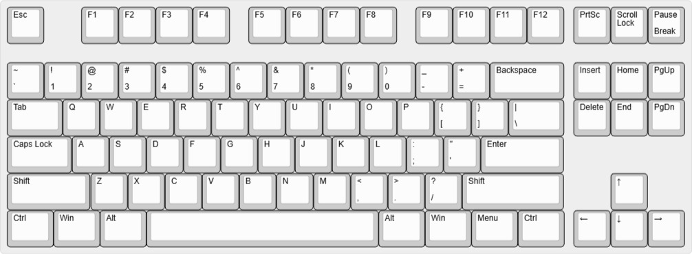
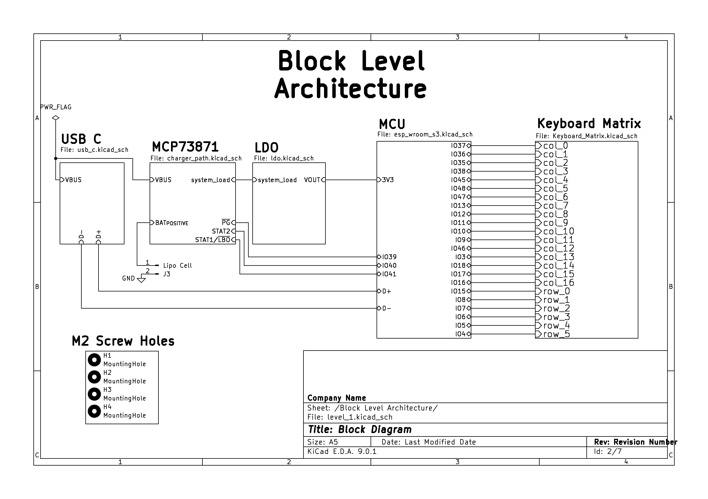
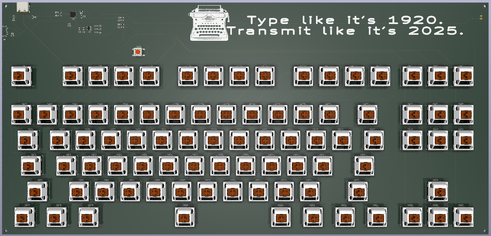
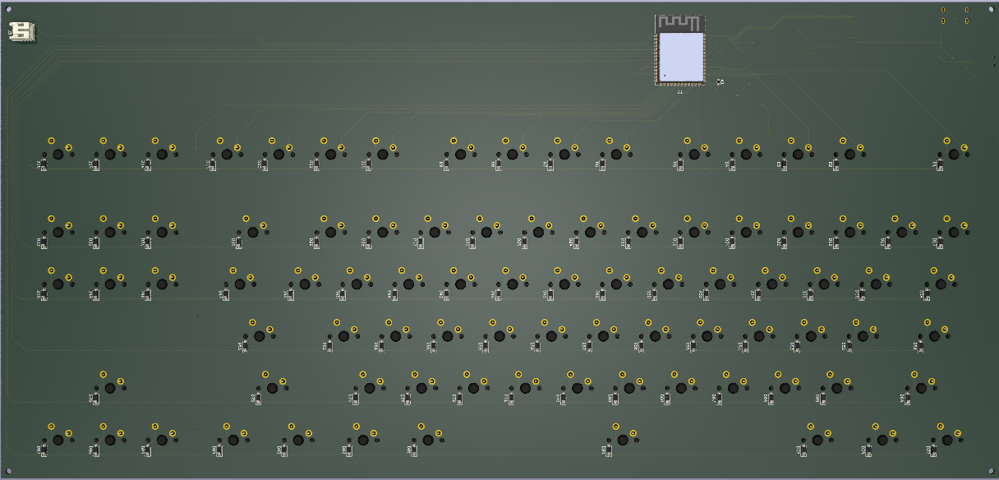

# **Wireless-Tenkeyless-Keyboard**

A compact wireless mechanical keyboard designed using the **ESP32-WROOM-S3** module. This project was developed as part of academic coursework.

> **Disclaimer:**  
> This design has not been fabricated or tested on hardware. Use at your own risk.

---

## **Keyboard Layout**

- Designed using [Keyboard Layout Editor](http://www.keyboard-layout-editor.com).
- Layout file: [layout.json](kle_files/keyboard-layout.json)
- Visual preview:

---

## **Schematic Overview**

The design follows a modular, hierarchical schematic structure:
- Root (page 1)
  - Block Level Architecture (page 2)
    - USB C (page 3)
    - MCP73871 (page 4)
    - LDO (page 5)
    - MCU (ESP32-WROOM-S3) (page 6)
    - Keyboard Matrix (page 7)

Full schematic: [schematic.pdf](schematic.pdf)

---

## **PCB Design**

---

## **Case Design**

- TODO

---

## **EMI Considerations**

- TODO
---

